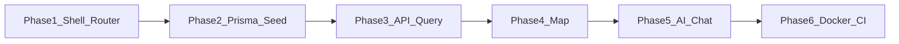

# Chat With Ancients — phased implementation plan

The workspace is currently empty, so this assumes a **small monorepo** (recommended): one Expo app (`apps/mobile`) and one Node API (`apps/api`) sharing a `packages/db` Prisma schema—or Prisma colocated in `apps/api` if you prefer fewer packages. MySQL runs locally via Docker Compose during development.

**Stack alignment notes**

- **Tailwind on React Native**: Use [NativeWind](https://www.nativewind.dev/) (Tailwind-compatible) with Expo, not web-only Tailwind.
- **assistant-ui**: Official [React Native / Expo docs](https://www.assistant-ui.com/docs/react-native) and `@assistant-ui/react-ai-sdk` pair cleanly with the **Vercel AI SDK** and streaming endpoints—good fit for your AI layer.
- **TanStack Router + Expo**: You asked for URLs like `/chat/socrates`. TanStack Router has an Expo-oriented path in their docs; **validate deep linking + file/route structure in Phase 1** so `/chat/:slug` works on device and web. If you hit friction, the fallback is Expo Router (industry default for Expo)—only switch if Phase 1 proves blocked, since you specified TanStack Router.

**Map engine decision (defer to Phase 4, not Phase 1)**

| Option                        | Pros                                                           | Cons                                         |
| ----------------------------- | -------------------------------------------------------------- | -------------------------------------------- |
| **react-native-maps**         | Simple markers, Expo-friendly, no extra map account for basics | Less custom map styling                      |
| **Mapbox (`@rnmapbox/maps`)** | Strong visuals, custom styles                                  | Token, native config, slightly heavier setup |

Choose in Phase 4 once the app shell and ancients data exist; both support tapping markers to navigate.

---

## Phase 1 — Repo, Expo shell, routing, styling

**Goal**: App launches on iOS/Android/web with typed routes and NativeWind working.

- Initialize monorepo (pnpm or npm workspaces).
- Create **Expo (TypeScript)** app in `apps/mobile`.
- Add **NativeWind** (Tailwind) and a minimal design token pass (colors, typography).
- Integrate **TanStack Router** for Expo per official guide; define routes such as:
  - `/` — map (placeholder screen)
  - `/chat/$slug` — chat screen (placeholder)
- Configure **deep linking** / universal links so `/chat/socrates` resolves correctly on at least one native target + web.
- Shared **TypeScript** config and env handling (e.g. `EXPO_PUBLIC_API_URL`).

**Exit criteria**: Cold start → navigate programmatically and via URL to `/chat/socrates` (stub UI).

---

## Phase 2 — Database, Prisma, seed “Ancients”

**Goal**: MySQL schema and seed data for map + chat metadata.

- Add **Docker Compose** service for **MySQL** (dev only in this phase is enough).
- **Prisma** schema, e.g. model `Ancient` with fields such as: `id`, `slug` (unique), `name`, `region`, `latitude`, `longitude`, `avatarUrl` (or asset key), `eraLabel`, `shortBio`, `systemPrompt` (or `personaId` + template in code—your choice; storing a concise persona snippet in DB keeps content editable without redeploy).
- **Seed**: Confucius, Socrates, Cleopatra (and any minimal fields needed for Phase 3–4).
- Generate Prisma Client; document `migrate` / `db push` workflow for teammates.

**Exit criteria**: `prisma studio` (or SQL) shows seeded rows; slugs match router params (`socrates`, etc.).

---

## Phase 3 — API + TanStack Query

**Goal**: Mobile loads ancients from the backend (no AI yet).

- Implement `**apps/api`**: minimal HTTP server (Hono, Express, or Fastify—pick one and keep it small) with:
  - `GET /ancients` — list for the map
  - `GET /ancients/:slug` — detail for chat header + persona metadata
- CORS and env for DB URL.
- In `**apps/mobile**`: **TanStack Query** `QueryClientProvider`, hooks `useAncients`, `useAncient(slug)`, loading/error UI on stubs.
- Point Expo env at local API (device vs simulator: use machine LAN IP or Expo’s documented host patterns).

**Exit criteria**: Map placeholder (or a simple list screen) shows live data from MySQL via API.

---

## Phase 4 — Map + navigation into chat

**Goal**: World map with tappable figure avatars → `/chat/:slug`.

- **Decide map engine** (`react-native-maps` vs Mapbox) and install/configure per Expo docs.
- Render **markers** from `useAncients()` (coordinates + avatar: custom marker or image).
- On marker press: `router.navigate({ to: '/chat/$slug', params: { slug } })`.
- Optional: fit map bounds to markers; handle empty/error states.

**Exit criteria**: Tapping Confucius / Socrates / Cleopatra opens the chat route with correct slug.

---

## Phase 5 — AI chat (Vercel AI SDK + Gemini + assistant-ui)

**Goal**: Streaming conversation scoped to the selected ancient.

- **Backend** (`apps/api`): route `POST /api/chat` (or similar) using **Vercel AI SDK** (`ai` package) with **Google Gemini** provider; `streamText` (or `streamUI` if you add tools later).
- **System prompt**: compose from `Ancient` record (era, philosophy focus, tone) + safety/educational guardrails.
- **assistant-ui** in `**apps/mobile`**: `@assistant-ui/react-native`, `@assistant-ui/react-ai-sdk`, `useChatRuntime` + transport pointing at your API; pass `slug` or `ancientId` so the server loads the right persona.
- Handle **API keys** only on the server (`GEMINI_API_KEY` in Docker/CI secrets).

**Exit criteria**: End-to-end streaming chat for at least one ancient; switching ancient changes behavior via server-side persona.

**Optional follow-up (same phase or Phase 6)**: Persist threads/messages in MySQL if you need history across sessions—add models `Conversation`, `Message` and optional user id later.

---

## Phase 6 — Docker + GitHub Actions deployment

**Goal**: Reproducible runs and automated deploy.

- **Dockerfile** for `apps/api` (Node production image, `prisma migrate deploy` on start or as init job—pick one pattern and document it).
- **docker-compose** (prod-shaped or staging): API + MySQL; env files documented (no secrets in repo).
- **GitHub Action** workflow: on push/tag—lint/test (if added), build and push image to GHCR or your registry, deploy to your host (SSH, Fly.io, Railway, etc.—**you’ll wire the specific target** in this step).
- Expo: **EAS Build** (separate from the API container) is the usual path for store binaries; web export can be static hosting if you ship web.

**Exit criteria**: One-command (or CI) deploy of API + DB; mobile pointed at deployed API URL for a smoke test.

---

## Suggested order diagram

---

## What this plan intentionally defers

- Full **content pipeline** for dozens of figures (CMS, i18n, image CDN)—add after the vertical slice works for three ancients.
- **Auth / classrooms**—not in your spec; add a later phase if needed.
- **Map engine** final choice—explicitly Phase 4.

When you approve, implementation can start with **Phase 1** only, then stop for review before Phase 2, matching your step-by-step preference.